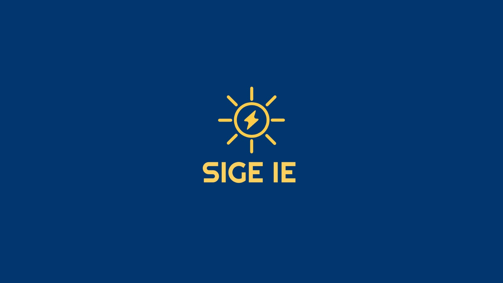

<h1 align="center">



SIGE IE
</h1>

### Fase do projeto
Release 1 <a href="https://github.com/ResidenciaTICBrisa/T2G3-Sistema-Instalacao-Eletrica/milestone/1">Ir para milestone da release 1</a>

### Sobre este projeto
Aplicativo web mobile desenvolvido para a Universidade de Brasília com objetivo de gerenciar as instalações elétricas e dar suporte ao retrofitting das instalações.
#### Posição
O SIGE IE é um sistema da Universidade de Brasília para o gerenciamento de instalações elétricas com o objetivo de facilitar o cadastro das informações de instalação elétrica para ajudar na reforma da parte elétrica dos prédios e salas. Ele permite a automatização da geração de relatórios das instalações elétricas de cada lugar e a centralização dessas informações para uso dos responsáveis pelas instalações. As pessoas devem usar o SIGE IE porque ele simplifica e agiliza o processo de gerenciamento, principalmente do retrofitting de instalações elétricas, garantindo maior eficiência e segurança.

#### Objetivos
Simplificar o cadastro e gerenciamento de informações de instalações elétricas e automatizar a geração de relatórios.
#### Tecnologias
##### Back-end

<div align="center">

| Nome | Versão | Uso | Configuração |
|---|---|---|---|
| Python | 3.11.8| Linguagem | [Site oficial do Python](https://www.python.org/downloads/)  Ou veja na seção "Como subir o back-end" |
| Django | 4.2 (LTS) | Framework web | Automática |
| Django REST framework | 3.14 | API REST | Automática |
| Docker | 25.0.4 | Conteiner e imagem | [Site oficial do Docker](https://docs.docker.com/desktop/install/ubuntu/) |
| Redis | 7.2 | Banco de dados cache para sessão | Automática via Docker |
| MySQL | 8.1 | Banco de dados | Automática via Docker |
| mysqlclient | 2.2.4 | Cliente para se conectar com MySQL | [Site do Pypi com as configurações](https://pypi.org/project/mysqlclient/) Ou veja na seção "Como subir o back-end"

</div>

###### Observação
Atualmente o Django REST Framework suporta as seguintes versões do Python e do Django:

<div align="center">

| Python | 3.6 | 3.7 | 3.8 | 3.9 | 3.10 | 3.11 |
|--------|-----|-----|-----|-----|------|------|
| Django | 3.0 | 3.1 | 3.2 | 4.0 | 4.1  | 4.2 (LTS) |

</div>

Como a versão LTS mais recente do Django (2024) é a 4.2, escolhemos configurar o projeto usando Python 3.11. 

##### Front-end mobile

<div align="center">
  
| Nome | Versão | Uso | Configuração |
|---|---|---|---|
| Flutter | 3.19.3 | Framework frontend | [Site oficial do Flutter](https://docs.flutter.dev/get-started/install/linux) |
| Android Studio | Iguana | IDE para desenvolvimento Android com Android SDK | [Site oficial do Android Studio](https://developer.android.com/studio/index.html) |

</div>

### Contribuidores 
<div align="center">
  <table>
    <tbody>
      <tr>
        <td>AlefMemTav</td>
        <td>Pedro Lucas</td>
        <td></td>
      </tr>
      <tr>
        <td>EngDann</td>
        <td>Danilo</td>
        <td></td>
      </tr>
      <tr>
        <td>kauan2872</td>
        <td>Kauan</td>
        <td></td>
      </tr>
      <tr>
        <td>OscarDeBrito</td>
        <td>Oscar</td>
        <td></td>
      </tr>
      <tr>
        <td>ramires31</td>
        <td>Ramires</td>
        <td></td>
      </tr>
    </tbody>
  </table>
</div>

### Como subir o projeto
Estas etapas são válidas para Linux OS e WSL.
#### Como subir o back-end:

Primeiramente, interrompa qualquer processo que use o porto 8080, 3306 e 6379.

Em seguida, caso já não tenha instalado:

- Instale o Python, Pip e os cabeçalhos do Python e MySQL:

  Python:
  ```
  sudo apt-get install python3.11
  ```

  Pip:
  ```
   sudo apt-get install python3-pip
  ```

  Cabeçalhos:
  ```
  sudo apt-get install python3.11-dev default-libmysqlclient-dev build-essential pkg-config
  ```

   mysqlclient:

   ```
   pip install mysqlclient
   ```

- Instale o virtualenv para criar um ambiente virtual do projeto:

    Virtualenv:
    ```
    pip install virtualenv
    ```

Dentro da pasta raiz `api`:

1. Cria o ambiente virtual e ative-o:

    Criar ambiente virtual:
     ```
     virtualenv -p python3.11 venv
     ``` 
  
    Ativar ambiente:
     ```
     source venv/bin/activate
     ``` 

3. Com o ambiente virtual ativado, instale as dependências:

   ```
   pip install -r requirements.txt
   ```

4. Com o docker iniciado, crie a imagem do banco de dados pela primeira vez:

   ```
   docker-compose build
   ```

6. Suba a imagem:

   ```
   docker-compose up
   ```

8. Ainda no diretório raiz `api`, aplique as migrações:

   ```
   python3 manage.py migrate
   ```

10. Inicie o servidor:

    ```
    python3 manage.py runserver
    ```

Pronto, o servidor já está rodando com o banco de dados configurado.
#### Como Subir o Front-end:

Antes de começar, verifique se o Flutter SDK está atualizado e compatível com o projeto. Siga as instruções específicas para sua plataforma (Windows, macOS, Linux) disponíveis na [documentação oficial do Flutter](https://flutter.dev/docs/get-started/install).

Caso ainda não tenha feito, instale os seguintes requisitos em sua máquina:

- **Flutter SDK**:
  Siga as instruções de instalação para a sua plataforma.

- **Android Studio ou Visual Studio Code**:

  - Android Studio:
    ```
    sudo snap install android-studio --classic
    ```

  - Visual Studio Code:
    ```
    sudo snap install code --classic
    ```
  Para o VS Code, instale as extensões do Flutter e Dart disponíveis na aba de extensões do editor.

- **Emulador Android ou um dispositivo físico**:
  Configure um emulador usando o AVD Manager do Android Studio ou [configure seu dispositivo Android para depuração USB](https://developer.android.com/studio/debug/dev-options). 

Com o ambiente preparado, siga os passos abaixo:

1. **Clone o Repositório do Front-end**:
    ```
    git clone https://github.com/ResidenciaTICBrisa/T2G3-Sistema-Instalacao-Eletrica.git
    ```

2. **Abra o Projeto no Editor**:
    Abra a pasta clonada no Android Studio ou no Visual Studio Code.

3. **Baixe as Dependências**:
    Abra um terminal no editor e execute o comando:
    ```
    flutter pub get
    ```

4. **Execute o Projeto**:
    - **No Android Studio:** Escolha um dispositivo ou emulador na barra de ferramentas e clique em 'Run'.
    - **No Visual Studio Code:** Selecione um dispositivo ou emulador na barra de status e pressione `F5` ou utilize o comando `Flutter: Run` na paleta de comandos.

Pronto, o Front end já está rodando e você pode utilizá-lo.


### Como contribuir
1. Faça um fork do repositório do projeto.
2. Clone o fork na sua máquina:
   
   ```
   git clone https://github.com/{seu-usuario}/T2G3-Sistema-Instalacao-Eletrica.git
   ```
   
4. Comente na issue que deseja contribuir ou crie uma issue nova.
5. Entre no repositório clonado na sua máquina:
    
   ```
   cd T2G3-Sistema-Instalacao-Eletrica
   ```
   
7. Após enviar suas contribuições para o fork do seu repositório, faça um pull request.
8. Aguarde a revisão. 

### Documentação
- [Cronograma](https://github.com/ResidenciaTICBrisa/T2G3-Sistema-Instalacao-Eletrica/issues/3)
- [Requisitos](https://github.com/ResidenciaTICBrisa/T2G3-Sistema-Instalacao-Eletrica/issues/1)
- [Arquitetura](https://github.com/ResidenciaTICBrisa/T2G3-Sistema-Instalacao-Eletrica/issues/2)
- [Atas de reunião](https://github.com/ResidenciaTICBrisa/T2G3-Sistema-Instalacao-Eletrica/issues/4)
